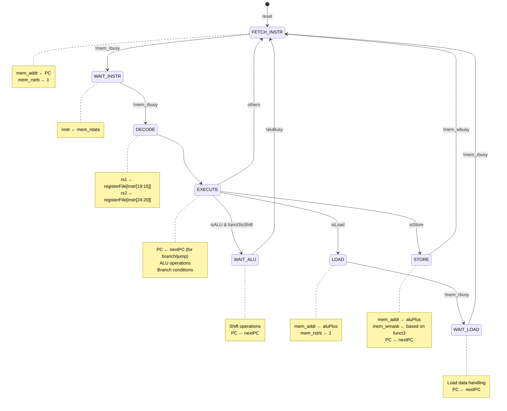
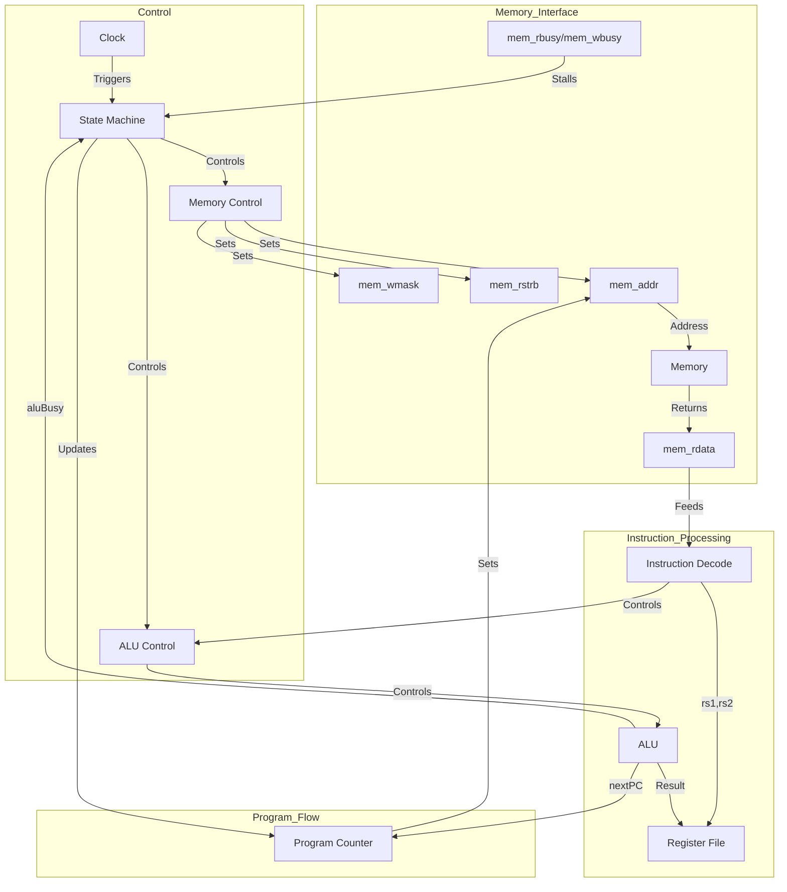
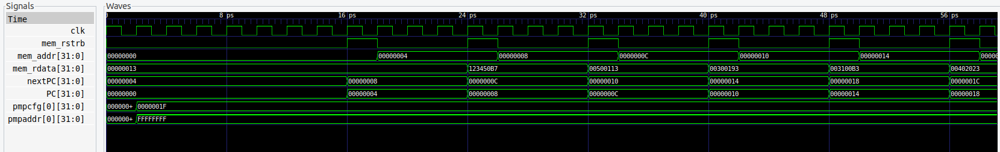

# FemtoRV32: A Compact RISC-V Processor Implementation

## Overview
- FemtoRV32 is a compact implementation of the RISC-V RV32I base integer instruction set. It features a streamlined 5-stage pipeline design with Physical Memory Protection (PMP) support, making it suitable for embedded systems and educational purposes.
- Inspired by the tuto: https://www.youtube.com/watch?v=8boamDdvD8s from the playlist of RISC-V Assembly Code
## Features
- Full RV32I base instruction set support
- 5-stage pipeline architecture
- Physical Memory Protection (PMP) with 4 configurable regions
- Memory interface with busy handling
- Trap handling support
- CSR (Control and Status Registers) support
- Verilator-based simulation environment

## Project Structure
```
femtorv_project/
├── src/
│   └── FemtoRV32.v       # Main processor implementation
├── tb/
│   └── FemtoRV_tb.cpp    # Testbench implementation
├── memory.hex            # Test program in hex format
├── synth.ys             # Yosys synthesis script
└── Makefile             # Build system
```

## Processor Architecture
The FemtoRV32 implements a state machine-based architecture with the following states:

1. FETCH_INSTR (0): Fetch instruction from memory
2. WAIT_INSTR (1): Wait for instruction fetch completion
3. DECODE (2): Decode instruction and read registers
4. EXECUTE (3): Execute instruction or branch
5. WAIT_ALU (4): Wait for ALU operations (shifts)
6. LOAD (5): Load data from memory
7. WAIT_LOAD (6): Wait for load completion
8. STORE (7): Store data to memory

### Physical Memory Protection (PMP)
- 4 configurable PMP entries
- Supports multiple addressing modes:
  - OFF: Null region
  - TOR: Top of range
  - NA4: 4-byte aligned
  - NAPOT: Power-of-two alignment
- Configurable read/write/execute permissions

## Building and Running

### Prerequisites
- Verilator
- C++ compiler
- GTKWave (for waveform viewing)
- Yosys (for synthesis)

### Build Instructions
```bash
# Clean previous build
make clean

# Build and run simulation
make

# View waveforms
make waves
```

### Test Program
The default test program (memory.hex) demonstrates:
- Basic arithmetic operations
- Memory load/store operations
- Branching
- Immediate value handling

## Instruction Support
The processor supports all RV32I instructions:
- Arithmetic: ADD, SUB, AND, OR, XOR
- Shifts: SLL, SRL, SRA
- Comparisons: SLT, SLTU
- Memory: LW, LH, LB, SW, SH, SB
- Branches: BEQ, BNE, BLT, BGE, BLTU, BGEU
- Jumps: JAL, JALR
- Special: LUI, AUIPC

## FSM State Transitions


The FSM implements an 8-state RISC-V processor pipeline with the following states:

1. **FETCH_INSTR (0)**: Initiates instruction fetch from memory using current PC
   - Sets mem_addr to PC
   - Activates mem_rstrb for memory read

2. **WAIT_INSTR (1)**: Waits for instruction memory read to complete
   - Captures instruction from mem_rdata when ready

3. **DECODE (2)**: Reads register file and prepares operands
   - Reads rs1 and rs2 from registerFile
   - Decodes instruction fields

4. **EXECUTE (3)**: Main execution state
   - Performs ALU operations
   - Handles branches and jumps
   - Updates PC for control flow instructions

5. **WAIT_ALU (4)**: Handles multi-cycle shift operations
   - Waits for shift operations to complete
   - Updates PC after completion

6. **LOAD (5)**: Initiates memory read for load instructions
   - Sets mem_addr to calculated address
   - Activates mem_rstrb for data read

7. **WAIT_LOAD (6)**: Waits for load data
   - Waits for memory read to complete
   - Updates PC after data is loaded

8. **STORE (7)**: Handles memory write operations
   - Sets mem_addr and mem_wmask
   - Writes data to memory
   - Updates PC after store completes

Key signals:
- mem_addr: Memory address for instruction/data access
- mem_rstrb: Read strobe for memory operations
- mem_wmask: Write mask for store operations
- PC: Program Counter
- aluBusy: Indicates ongoing shift operation
- mem_rbusy/mem_wbusy: Memory operation status

The FSM includes wait states to handle memory latency and multi-cycle ALU operations, with busy signals controlling state transitions.

## Memory Interface
- 32-bit address bus
- 32-bit data bus
- Byte-level write mask
- Busy signals for read/write operations
- Support for unaligned accesses

## Debug Features
- Waveform generation (VCD format)
- Instruction decoding in testbench
- Trap handling and reporting
- Cycle-accurate simulation

## Synthesis
The project includes a Yosys synthesis script (synth.ys) that:
1. Reads the Verilog design
2. Performs optimization
3. Maps to gates
4. Generates netlist
5. Creates visualization

## Contributing
- If anyone wants to add a new waveform or an image please follow those steps :
1. Place images in the `images/` directory
2. Use descriptive filenames
3. Update README.md to reference new images
4. Include signal descriptions and timing analysis

## Waveform Analysis and Signal Behavior

### Key Signals and Their Behavior
```
Time ------>
clk          ‾\_/‾\_/‾\_/‾\_/‾\_/‾\_/‾  Clock signal (System clock)
            The main system clock that drives all sequential logic in the processor.
            Rising edge triggers state updates throughout the design.

mem_addr     00→04→08→0C→10→14          Program Counter incrementing by 4
            Memory address bus showing instruction fetch addresses.
            Increments by 4 bytes each cycle (32-bit instruction alignment).
            Values shown in hexadecimal.

mem_rdata    NOP→LUI→ADD→SUB→...        Instruction being fetched
            Data read from memory, containing the current instruction.
            Shows the instruction type being executed each cycle:
            - NOP: No Operation
            - LUI: Load Upper Immediate
            - ADD: Addition
            - SUB: Subtraction

mem_rstrb    ___/‾\___/‾\___/‾\___      Read strobe for instruction fetch
            Active-high signal indicating valid instruction fetch.
            Pulses high when the processor is requesting an instruction.
            Width indicates fetch duration.

mem_wdata    00→00→00→03030303→00       Data being written to memory
            Data to be written to memory during store operations.
            Shows actual values being written (in hexadecimal).
            '03030303' example shows a word-aligned store.

mem_wmask    0→0→0→F→0                  Write mask (F = all bytes active)
            Controls which bytes are written during store operations:
            - 0: No bytes written
            - F: All bytes written (full 32-bit word)
            - Other values enable specific bytes (1,2,4,8 for individual bytes)

reset        0→1                         Initial reset, then stays high
            System reset signal:
            - 0: Processor in reset state
            - 1: Normal operation
            Used to initialize processor state on startup.

trap         0                           No traps occurred
            Indicates exceptional conditions:
            - 0: Normal operation
            - 1: Exception or interrupt occurred
            Used for error handling and debugging.

trap_cause   0                           No trap cause (normal operation)
            Encodes the reason for a trap when trap signal is high.
            0 indicates normal operation (no trap active).
            Other values indicate specific exception types.
```

### Instruction Execution Sequence
The waveform demonstrates the processor executing the test program:

1. **Initial State** (0-8ps):
   - Reset sequence completes
   - PC starts at 0x00000000
   - First NOP instruction (0x00000013)

2. **LUI Instruction** (8-16ps):
   - PC: 0x00000004
   - Instruction: 0x123450B7 (LUI x1, 0x12345)
   - Loads upper immediate into register

3. **ADDI Instructions** (16-32ps):
   - PC: 0x00000008, 0x0000000C
   - Instructions: 
     - 0x00500113 (ADDI x2, x0, 5)
     - 0x00300193 (ADDI x3, x0, 3)

4. **ADD and Store** (32-48ps):
   - PC: 0x00000010, 0x00000014
   - Instructions:
     - 0x003100B3 (ADD x4, x2, x3)
     - 0x00402023 (SW x4, 0(x0))
   - mem_wdata becomes active during store

### Signal Relationships


### Key Signal Descriptions

1. **Clock and Control**
   - `clk`: System clock driving all sequential logic
   - `state`: Current FSM state (3-bit)
   - `reset`: System reset signal

2. **Memory Interface**
   - `mem_addr[31:0]`: Memory address for instructions/data
   - `mem_rdata[31:0]`: Data read from memory
   - `mem_wdata[31:0]`: Data to write to memory
   - `mem_wmask[3:0]`: Byte-level write mask
   - `mem_rstrb`: Read strobe signal
   - `mem_rbusy/mem_wbusy`: Memory operation status

3. **Instruction Processing**
   - `instr[31:0]`: Current instruction
   - `rs1[31:0]`: First source register value
   - `rs2[31:0]`: Second source register value
   - `rdId[4:0]`: Destination register address
   - `funct3Is[7:0]`: Decoded function field (one-hot)

4. **ALU Signals**
   - `aluIn1[31:0]`: First ALU input (rs1)
   - `aluIn2[31:0]`: Second ALU input (rs2 or immediate)
   - `aluOut[31:0]`: ALU result
   - `aluBusy`: Indicates ongoing shift operation
   - `aluPlus[31:0]`: Addition result

5. **Program Flow**
   - `PC[31:0]`: Program Counter
   - `nextPC[31:0]`: Next instruction address
   - `takeBranch`: Branch condition result

### Signal Timing
```
Clock     ↑   ↑   ↑   ↑   ↑   ↑   ↑   ↑   ↑
          │   │   │   │   │   │   │   │   │
State     F→W→D→E→W   F→W→D→E   F→W→D→E
          │   │   │   │   │   │   │   │   │
mem_rstrb ┌─┐ │   │   │   ┌─┐ │   │   ┌─┐
          │ │ │   │   │   │ │ │   │   │ │
mem_addr  PC  │   │   │   PC  │   │   PC
          │   │   │   │   │   │   │   │   │
mem_rdata ────┤Ins├───│   ────┤Ins├───────
          │   │   │   │   │   │   │   │   │
PC        ────────────┼───────────┼───────
                      │           │
Legend:   F=FETCH     W=WAIT      D=DECODE
          E=EXECUTE   Ins=Instruction
```

This timing diagram shows how key signals interact during instruction execution, with:
- State transitions on clock edges
- Memory access timing
- Instruction flow through pipeline stages

### Memory Access Patterns
1. **Instruction Fetch**:
   - mem_addr updates on clock edge
   - mem_rstrb pulses high
   - mem_rdata returns instruction

2. **Data Load**:
   - Similar to instruction fetch
   - Address comes from ALU calculation

3. **Data Store**:
   - mem_wmask indicates active bytes
   - mem_wdata contains data to write
   - Address from ALU calculation

### Timing Relationships
- All state transitions occur on rising clock edge
- Memory operations start immediately after state change
- Busy signals (mem_rbusy, mem_wbusy) control state progression
- One instruction typically takes multiple clock cycles 

### Waveform Visualization

<div style="display: flex; justify-content: space-between;">
    <div style="flex: 1; margin-right: 10px;">
        <p><strong>Basic Waveform Overview:</strong></p>
        
    </div>
    <div style="flex: 1; margin-left: 10px;">
        <p><strong>Detailed Signal Analysis:</strong></p>
        
    </div>
</div>

The waveforms above show:

**Left Waveform (Overview):**
- Basic processor operation
- Clock and state transitions
- Memory interface signals
- Instruction flow

**Right Waveform (Detailed):**
- Detailed signal transitions
- Memory address changes (mem_addr)
- Instruction data flow (mem_data)
- Program counter progression (PC, nextPC)
- PMP configuration signals

This visualization demonstrates the processor's operation through multiple clock cycles, showing how instructions are fetched, decoded, and executed while maintaining proper memory protection through the PMP configuration. 