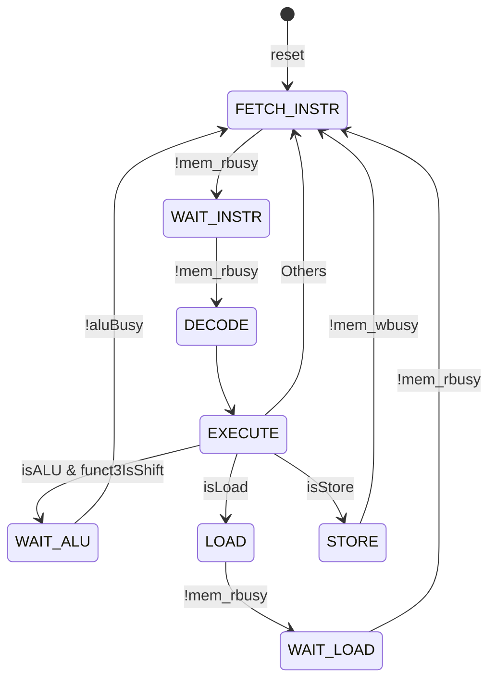
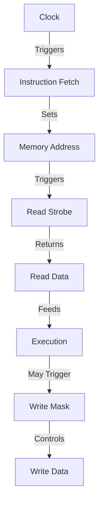
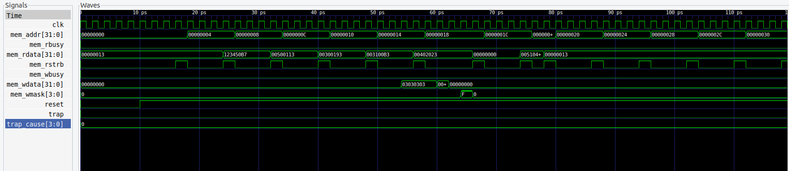

# FemtoRV32: A Compact RISC-V Processor Implementation

## Overview
FemtoRV32 is a compact implementation of the RISC-V RV32I base integer instruction set. It features a streamlined 5-stage pipeline design with Physical Memory Protection (PMP) support, making it suitable for embedded systems and educational purposes.

## Features
- Full RV32I base instruction set support
- 5-stage pipeline architecture
- Physical Memory Protection (PMP) with 4 configurable regions
- Memory interface with busy handling
- Trap handling support
- CSR (Control and Status Registers) support
- Verilator-based simulation environment

## Project Structure
```
femtorv_project/
├── src/
│   └── FemtoRV32.v       # Main processor implementation
├── tb/
│   └── FemtoRV_tb.cpp    # Testbench implementation
├── memory.hex            # Test program in hex format
├── synth.ys             # Yosys synthesis script
└── Makefile             # Build system
```

## Processor Architecture
The FemtoRV32 implements a state machine-based architecture with the following states:

1. FETCH_INSTR (0): Fetch instruction from memory
2. WAIT_INSTR (1): Wait for instruction fetch completion
3. DECODE (2): Decode instruction and read registers
4. EXECUTE (3): Execute instruction or branch
5. WAIT_ALU (4): Wait for ALU operations (shifts)
6. LOAD (5): Load data from memory
7. WAIT_LOAD (6): Wait for load completion
8. STORE (7): Store data to memory

### Physical Memory Protection (PMP)
- 4 configurable PMP entries
- Supports multiple addressing modes:
  - OFF: Null region
  - TOR: Top of range
  - NA4: 4-byte aligned
  - NAPOT: Power-of-two alignment
- Configurable read/write/execute permissions

## Building and Running

### Prerequisites
- Verilator
- C++ compiler
- GTKWave (for waveform viewing)
- Yosys (for synthesis)

### Build Instructions
```bash
# Clean previous build
make clean

# Build and run simulation
make

# View waveforms
make waves
```

### Test Program
The default test program (memory.hex) demonstrates:
- Basic arithmetic operations
- Memory load/store operations
- Branching
- Immediate value handling

## Instruction Support
The processor supports all RV32I instructions:
- Arithmetic: ADD, SUB, AND, OR, XOR
- Shifts: SLL, SRL, SRA
- Comparisons: SLT, SLTU
- Memory: LW, LH, LB, SW, SH, SB
- Branches: BEQ, BNE, BLT, BGE, BLTU, BGEU
- Jumps: JAL, JALR
- Special: LUI, AUIPC

## FSM State Transitions


## Memory Interface
- 32-bit address bus
- 32-bit data bus
- Byte-level write mask
- Busy signals for read/write operations
- Support for unaligned accesses

## Debug Features
- Waveform generation (VCD format)
- Instruction decoding in testbench
- Trap handling and reporting
- Cycle-accurate simulation

## Synthesis
The project includes a Yosys synthesis script (synth.ys) that:
1. Reads the Verilog design
2. Performs optimization
3. Maps to gates
4. Generates netlist
5. Creates visualization

## Contributing
Feel free to contribute to this project by:
- Adding new features
- Improving documentation
- Fixing bugs
- Enhancing test coverage

When contributing waveforms or images:
1. Place images in the `images/` directory
2. Use descriptive filenames
3. Update README.md to reference new images
4. Include signal descriptions and timing analysis

## License
[Insert License Information]

## Waveform Analysis and Signal Behavior

### Key Signals and Their Behavior
```
Time ------>
clk          ‾\_/‾\_/‾\_/‾\_/‾\_/‾\_/‾  Clock signal (System clock)
mem_addr     00→04→08→0C→10→14          Program Counter incrementing by 4
mem_rdata    NOP→LUI→ADD→SUB→...        Instruction being fetched
mem_rstrb    ___/‾\___/‾\___/‾\___      Read strobe for instruction fetch
mem_wdata    00→00→00→03030303→00       Data being written to memory
mem_wmask    0→0→0→F→0                  Write mask (F = all bytes active)
reset        0→1                         Initial reset, then stays high
trap         0                           No traps occurred
trap_cause   0                           No trap cause (normal operation)
```

### Instruction Execution Sequence
The waveform demonstrates the processor executing the test program:

1. **Initial State** (0-8ps):
   - Reset sequence completes
   - PC starts at 0x00000000
   - First NOP instruction (0x00000013)

2. **LUI Instruction** (8-16ps):
   - PC: 0x00000004
   - Instruction: 0x123450B7 (LUI x1, 0x12345)
   - Loads upper immediate into register

3. **ADDI Instructions** (16-32ps):
   - PC: 0x00000008, 0x0000000C
   - Instructions: 
     - 0x00500113 (ADDI x2, x0, 5)
     - 0x00300193 (ADDI x3, x0, 3)

4. **ADD and Store** (32-48ps):
   - PC: 0x00000010, 0x00000014
   - Instructions:
     - 0x003100B3 (ADD x4, x2, x3)
     - 0x00402023 (SW x4, 0(x0))
   - mem_wdata becomes active during store

### Signal Relationships


### Memory Access Patterns
1. **Instruction Fetch**:
   - mem_addr updates on clock edge
   - mem_rstrb pulses high
   - mem_rdata returns instruction

2. **Data Load**:
   - Similar to instruction fetch
   - Address comes from ALU calculation

3. **Data Store**:
   - mem_wmask indicates active bytes
   - mem_wdata contains data to write
   - Address from ALU calculation

### Timing Relationships
- All state transitions occur on rising clock edge
- Memory operations start immediately after state change
- Busy signals (mem_rbusy, mem_wbusy) control state progression
- One instruction typically takes multiple clock cycles 

### Waveform Visualization


The waveform above shows the processor executing the test program from memory.hex. Key signals are shown including clock, memory interface, and control signals. The simulation was captured using GTKWave after running `make waves`.

To capture your own waveform visualization:
1. Run the simulation: `make`
2. Open waveform viewer: `make waves`
3. In GTKWave:
   - Select relevant signals from the left panel
   - Adjust time scale for better visibility
   - Use Zoom Fit (press 'F' key)
   - File → Write Save File to save signal selection
   - File → Export → Write PNG to save image 